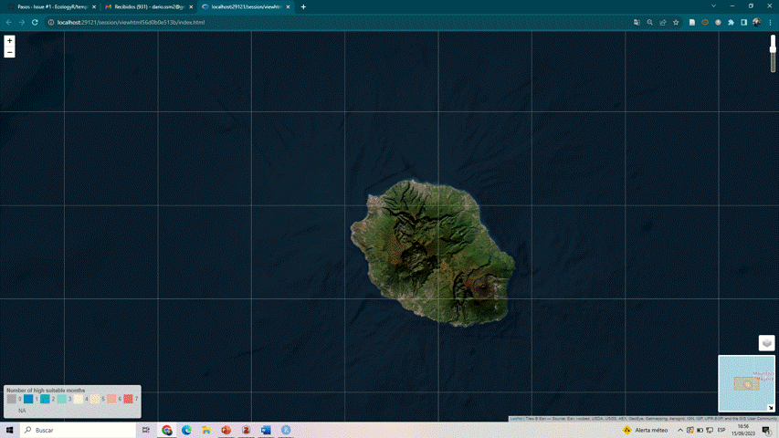

<!-- README.md is generated from README.Rmd. Please edit that file -->

```{r, include = FALSE}
knitr::opts_chunk$set(
  collapse = TRUE,
  comment = "#>",
  fig.path = "man/figures/README-",
  out.width = "100%"
)
```

# mappestRisk

<!-- badges: start -->

[](https://github.com/EcologyR/templateRpackage/actions/workflows/R-CMD-check.yaml) [](https://app.codecov.io/gh/EcologyR/templateRpackage?branch=master) `r badger::badge_lifecycle("experimental")` `r badger::badge_repostatus("WIP")` <!-- `r badger::badge_codefactor("ecologyr/templaterpackage")` -->

<!-- badges: end -->

The goal of mappestRisk package is to facilitate the transition from development data of pests obtained in lab-controlled conditions to understandable forecasts assessing risk of pest occurrence in a given region.

For that purpose, mappestRisk is built upon previous efforts such as `devRate` [@rebaudo2018], `rTPC` and `nls.multstart` packages [@padfield2021] and a methodology for predicting climatic suitability based on fundamental thermal niche as estimated by mechanistic, process-based approaches suggested in @taylor2019 . Therefore, mappestRisk has three different modules: *(1) model fitting & selection* using a set of the most widely used equations describing developmental responses to temperature under the `nls.multstart` [@nls.multstart] and `nlme` [@nlme] frameworks, with visualization of model fitting to help model selection by the user; (2) *thermal traits extraction:* including selection of the suitability threshold guiding the forecast (i.e. obtaining the temperatures at which estimated performance lies upon a performance higher threshold percentage); and (3) *climatic data extraction & visualization* with either exportable rasters or interactive maps with `leaflet` [@leaflet].

## Installation

```{r}
# install.packages("devtools")
# devtools::install_github("EcologyR/mappestRisk")

#or alternatively
# remotes::install_github("EcologyR/mappestRisk")

#and load the package
#library(mappestRisk)
devtools::load_all() #for now, provisionally

library(ggplot2)
library(dplyr)
library(nls.multstart)
library(rTPC)
library(devRate)
library(tidyr)
library(purrr)
```

If you want to clone or fork the repository or open and read some issues, you can find the code [here](https://github.com/EcologyR/mappestRisk).

## Example: mappestRisk workflow

### 1. Fit a thermal performance curve (TPC) to your data:

In this example, we'll show how to fit one to several thermal performance curves to a data set of development rate variation across temperatures[^1]. The following code provides an example as given in `fit_devmodels()` function documentation, with a data table showing the output of fitted models.

[^1]: At least 4 unique temperatures are required. Fore more details, see documentation and vignettes.

```{r, message=FALSE, warning=FALSE}
data("b.schwartzi_satar2002")

fitted_tpcs_aphid <- fit_devmodels(temp = b.schwartzi_satar2002$temperature,
                                   dev_rate = b.schwartzi_satar2002$rate_value,
                                   model_name = "all")
print(fitted_tpcs_aphid)
```

### 2. Plot the fitted TPCs and select the most appropriate:

To help select which model might be more appropriate, the function `plot_devmodels()` draws the predicted TPCs for each adequately-converged model. This step aims to improve model selection based not only on statistical criteria (i.e. AIC and number of parameters) but also on ecological realism, since curves can be graphically checked to select realistic shapes and thermal traits --vertical cuts with x-axis such as $CT_\min$, $CT_\max$ and $T_\text{opt}$ .

```{r, warning=FALSE}
plot_devmodels(temp = b.schwartzi_satar2002$temperature,
               dev_rate = b.schwartzi_satar2002$rate_value,
               fitted_parameters = fitted_tpcs_aphid,
               species = "Brachycaudus schwartzi",
               life_stage = "Nymphs")
```

### 3. Calculate predictions and bootstrap 100 TPCs for propagating parameter uncertainty

After careful examination of fitted TPCs in `plot_devmodels()`, the predictions of the selected models must be allocated in a `data.frame` in order to continue the package workflow towards climatic projection for pest risk analysis. Additionally, we recommend here to propagate uncertainty in parameter estimation of the fitted and selected TPC models using bootstrap procedures following vignettes in @padfield2021. This can be done with the function `predict_curves()` by setting the argument `propagate_uncertainty` to be `TRUE` and by providing a number of bootstrap sampling iterations in the argument `n_boots_samples`.

This function requires some time to compute bootstraps and predictions of the multiple TPCs it generates. Hence, it is important to use only one or few TPC models in the argument `model_name_2boot` based on visual examination from `plot_devmodels()` with reasonable selection. We discourage to bootstrap all TPC models for computational and time consuming reasons.

In our example, we choose three models that performed similarly and, unlike others with similar or even higher AICs, had a markedly higher left-skewness, e.g., *briere2, thomas* and *lactin2.* After a few minutes, we obtain the `data.frame`:

```{r, warning=FALSE}
library(boot)
library(car)


preds_boots_aphid <-predict_curves(temp = b.schwartzi_satar2002$temperature,
                                   dev_rate = b.schwartzi_satar2002$rate_value,
                                   fitted_parameters = fitted_tpcs_aphid,
                                   model_name_2boot = c("briere2",
                                                        "thomas",
                                                        "lactin2"),
                                   propagate_uncertainty = TRUE,
                                   n_boots_samples = 100)
```

### 4. Plot uncertainty TPCs:

The bootstrapped uncertainty curves can be plotted easily with the `plot_uncertainties()` function.

```{r, message=FALSE}
plot_uncertainties(bootstrap_uncertainties_tpcs = preds_boots_aphid,
                   temp = b.schwartzi_satar2002$temperature,
                   dev_rate = b.schwartzi_satar2002$rate_value,
                   species = "Brachycaudus schwartzi",
                   life_stage = "Nymphs")
```

### 5. Calculate thermal suitability bounds:

Once a model have been selected under both ecological realism and statistical criteria, the user can estimate the thermal boundaries defining the suitable range of temperatures for the studied population. The `thermal_suitability_bounds()` function calculate these values given the `tibble` output from `predict_curves()` function and the selected model name (note that only one model is allowed each time for this function). Additionally, a value of suitability defining the quantile-upper part of the curve can be provided by the user ($\text{Q}_{75}$ by default). If the user has propagated uncertainty in `predict_curves()` function, this function inherits the bootstrapped TPCs to calculate thermal suitability boundaries for each bootstrapped curved in addition to the estimated curve.

```{r, warning=FALSE}
boundaries_aphid <- therm_suit_bounds(preds_tbl = preds_boots_aphid,
                                      model_name = "lactin2",
                                      suitability_threshold = 80)
print(boundaries_aphid)
```

### 4. Climatic data extraction and projection

Using the thermal boundaries provided by the previous function and a set of raster maps of monthly temperatures for a given region (which can be provided by the user or downloaded by the function), a map can be produced showing where (and for how many months a year) thermal conditions are suitable for the development of the pest.

```{r}
# downloading data from geodata::wordlclim_global. It will take several minutes the first time you use the function on the same 'path'.
#   risk_rast <- map_risk(t_vals = c(thermal_boundaries_sharpshooter$tval_left,
#                                    thermal_boundaries_sharpshooter$tval_right),
#                         path = "~/downloaded_maps", # directory to download data
#                         region = "Réunion", 
#                         verbose = TRUE)
# terra::plot(risk_rast[[13]]) # the last layer represents the sum of suitable months within a year; the first 12 layers, the monthly binary value (1, if suitable; 0, if not suitable).

#we can also save the raster with:
# terra::writeRaster(risk_rast, filename = "~/output_maps/risk_rast.tif")

# Alternatively, if you already have a raster of monthly average temperatures for your region of interest, you can use it as an input of `map_risk()`
## load it (here Luxembourg data)
#tavg_file <- system.file("extdata/tavg_lux.tif", package = "mappestRisk")
### convert it into a raster-compatible file with `terra`
#tavg_rast <- terra::rast(tavg_file)
### and apply the function
#risk_rast_binary <- map_risk(t_vals = c(thermal_boundaries_sharpshooter$tval_left,
#                                        thermal_boundaries_sharpshooter$tval_right#), 
#                             t_rast = tavg_rast)
# terra::plot(risk_rast_binary[[13]]) # the last layer represents the sum of suitable months within a year; the 12-th previous ones, the monthly binary value (1, if suitable; 0, if not suitable).


```

### 5. Interactive map with `leaflet`

```{r}
#example <- interactive_map(x = risk_rast_binary, map_type = "high",
 #               path_out = paste0(tempdir(), "test_map.html"))
#example

#htmlwidgets::saveWidget(example,file = "index.html")
```

A provisional example of the kind of output from `interactive_map()` is shown in the following animated picture:



## Citation

If using this package, please cite it:

```{r comment=NA}
citation("mappestRisk")
```

## Funding

The development of this software has been funded by Fondo Europeo de Desarrollo Regional (FEDER) and Consejería de Transformación Económica, Industria, Conocimiento y Universidades of Junta de Andalucía (proyecto US-1381388 led by Francisco Rodríguez Sánchez, Universidad de Sevilla).


## References:
