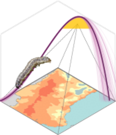

<!-- README.md is generated from README.Rmd. Please edit that file -->

```{r, include = FALSE}
knitr::opts_chunk$set(
  collapse = TRUE,
  comment = "#>",
  fig.path = "man/figures/README-",
  out.width = "100%"
)
```

# mappestRisk <a href="https://ecologyr.github.io/mappestRisk/"></a>

<!-- badges: start -->

`r badger::badge_cran_release()`  [](https://ecologyr.r-universe.dev/mappestRisk) [](https://ecologyr.r-universe.dev/mappestRisk) [](https://github.com/EcologyR/mappestRisk/actions/workflows/R-CMD-check.yaml) [](https://app.codecov.io/gh/EcologyR/mappestRisk) `r badger::badge_lifecycle("stable")` `r badger::badge_repostatus("Active")` [](https://cran.r-project.org/package=mappestRisk) [](https://cran.r-project.org/package=mappestRisk)

<!-- badges: end -->

## Aims of the package

The goal of `mappestRisk` package is to facilitate the transition from development data of arthropod crop-pests' thermal biology obtained in lab-controlled conditions to understandable forecasts assessing risk of pest occurrence in a given region. Closing this gap usually involves two key steps: (1) fitting and selecting nonlinear regression models and derived thermal traits under ecological criteria, and (2) projecting these traits onto interest regions for pest risk assessment by extracting climate data. However, most data producers from physiology labs have limited opportunities and time to develop their R programming skills, so addressing these two steps may not be straightforward.

For this purpose, `mappestRisk` intends to facilitate this workflow for any researcher with minimal, basic R programming skills. This package has been built upon previous efforts such as `devRate` [@rebaudo2018], `rTPC` and `nls.multstart` packages [@padfield2021] and a methodology for predicting climatic suitability based on fundamental thermal niche as estimated by thermal performance curves, as suggested in @taylor2019 . Up to date, `mappestRisk` is built for modelling developmental thermal performance curves, since this is the most commonly measured life-history trait in experimental approaches and it has major contributions to fitness dependence on temperature [@pawar2024] and it also allows to predict phenologies [@vonschmalensee2021].

Therefore, `mappestRisk` has three different modules: *(1) model fitting & selection* using a set of the most commonly used equations describing developmental responses to temperature under the `nls.multstart` framework [@nls.multstart] using equation helpers from `rTPC`[@rTPC] and `devRate` [@devRate], with visualization of model fitting to help model selection by the user; (2) *calculation of suitability thermal limits,* which consist on a temperature interval delimiting the optimal performance zone or suitability; and (3) *climatic data extraction & visualization* with either exportable rasters or static or interactive map figures.

## Installation

`mappestRisk` package's latest version can be installed from the [r-universe](https://ecologyr.r-universe.dev/mappestRisk):

```{r, eval=FALSE}
install.packages('mappestRisk', repos = c('https://ecologyr.r-universe.dev', 'https://cloud.r-project.org')) 
```

You can also install its latest version from the [GitHub repository](https://github.com/EcologyR/mappestRisk) after installing either `remotes` or `devtools` R packages.

```{r, eval=FALSE}
remotes::install_github("EcologyR/mappestRisk")  
#alternatively -> devtools::install_github("EcologyR/mappestRisk")
```

## Example: `mappestRisk` workflow

### 1. Fit thermal performance curves (TPC) to your data and plot results and parameter uncertainty:

In this example, we'll show how to fit one to several thermal performance curves to a data set of development rate variation across temperatures[^1]. The following code provides an example as given in `fit_devmodels()` function documentation, with a data table showing the output of fitted models, and how to visualize them for selecting curves using `plot_devmodels()`.

[^1]: At least 4 unique temperatures are required. Fore more details, see documentation and vignettes.

```{r,  warning=FALSE, message=FALSE}
library("mappestRisk")
data("aphid") 
fitted_tpcs <- fit_devmodels(temp = aphid$temperature,  
                             dev_rate = aphid$rate_value, 
                             model_name = c("briere2", "lactin2", "thomas"))

plot_devmodels(temp = aphid$temperature,
               dev_rate = aphid$rate_value,
               fitted_parameters = fitted_tpcs,
               species = "Brachycaudus schwartzi",
               life_stage = "Nymphs")
```

For a more complete explanation and example of model fitting and visualization, see [TPCs model fitting](articles/tpcs-model-fitting.html) article.

Additionally, we recommend here to propagate uncertainty in parameter estimation of the fitted and selected TPC models using bootstrap procedures with *residual resampling*, following vignettes of `rTPC` package [@padfield2021]. This can be done with the function `predict_curves()` by setting the argument `propagate_uncertainty` to be `TRUE`. Resulting predictions can be plotted using `plot_uncertainties()`. A detailed explanation is given in the [TPCs model fitting](articles/tpcs-simulate-bootstrap.html) article.

```{r, warning=FALSE, fig.width=12, fig.height=5, dpi=300, out.width="100%", cache = TRUE}
preds_boots <- predict_curves(temp = aphid$temperature,          
                              dev_rate = aphid$rate_value,
                              fitted_parameters = fitted_tpcs,
                              model_name_2boot = c("briere2", "lactin2", "thomas"),
                              propagate_uncertainty = TRUE,
                              n_boots_samples = 10)

plot_uncertainties(bootstrap_tpcs = preds_boots,
                   temp = aphid$temperature,
                   dev_rate = aphid$rate_value,
                   species = "Brachycaudus schwartzi",
                   life_stage = "Nymphs")
```

### 2. Calculate thermal suitability bounds:

After the previous steps, the user can calculate the thermal boundaries of the optimal zone of the TPC –i.e., those temperature values yielding the Y-th quantile of the development rate (default to $\textrm{Q}_{75}$) at both sides of the curve peak or $R_\max$. Once a model has been selected under both ecological and statistical criteria, the `thermal_suitability_bounds()` function calculates these values:

```{r, warning=FALSE}
boundaries <- therm_suit_bounds(preds_tbl = preds_boots,
                                model_name = "lactin2",        
                                suitability_threshold = 80) 
```

### 3. Climatic data extraction and projection

These optimal thermal boundaries are used for spatial projection of pest risk. The `map_risk()` function automatically downloads temperature data into a `SpatRaster` format from [WorldClim](https://worldclim.org/data/worldclim21.html) masked into an user-defined region or area, and then calculates the number of months per year with highly suitable temperatures for pest development.

```{r, message = FALSE, eval=FALSE}
risk_rast <- map_risk(t_vals = boundaries, 
                      region = "Réunion",   
                      path = tempdir() # directory to download climate data 
                      )
```

```{r, message = FALSE, eval=TRUE, echo=FALSE}
t_rast <- terra::rast("vignettes/articles/REU_wc2.1_30s_tavg.tif")
risk_rast <- map_risk(t_vals = boundaries, 
                      t_rast = t_rast,
                      path = tempdir())
```

### Citation

If using this package, please cite it:

```{r comment=NA}
citation("mappestRisk") 
```

## Funding

The development of this software has been funded by Fondo Europeo de Desarrollo Regional (FEDER) and Consejería de Transformación Económica, Industria, Conocimiento y Universidades of Junta de Andalucía (proyecto US-1381388, Universidad de Sevilla).


## Code of Conduct

Please note that the mappestRisk project is released with a [Contributor Code of Conduct](https://ecologyr.github.io/mappestRisk/CODE_OF_CONDUCT.html). By contributing to this project, you agree to abide by its terms.

## References:
