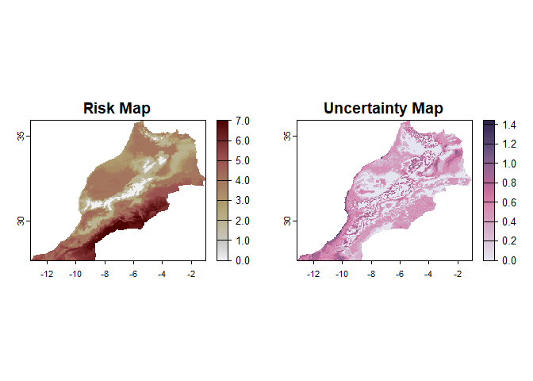
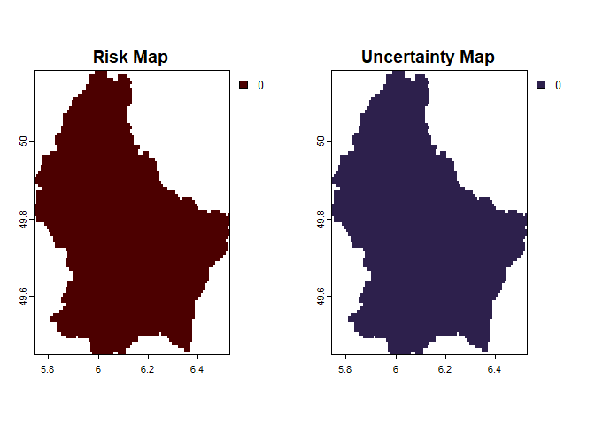
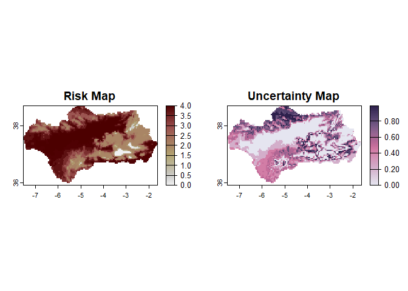

<!-- README.md is generated from README.Rmd. Please edit that file -->

# mappestRisk

<!-- badges: start -->

[](https://github.com/EcologyR/templateRpackage/actions/workflows/R-CMD-check.yaml)
[](https://app.codecov.io/gh/EcologyR/templateRpackage?branch=master)
[](https://lifecycle.r-lib.org/articles/stages.html#experimental)
[](https://www.repostatus.org/#wip)
<!-- [](https://www.codefactor.io/repository/github/ecologyr/templaterpackage) -->

<!-- badges: end -->

The goal of `mappestRisk` package is to facilitate the transition from
development data of pests obtained in lab-controlled conditions to
understandable forecasts assessing risk of pest occurrence in a given
region.

For that purpose, mappestRisk is built upon previous efforts such as
`devRate` (François Rebaudo, Struelens, and Dangles 2018), `rTPC` and
`nls.multstart` packages (Padfield, O’Sullivan, and Pawar 2021) and a
methodology for predicting climatic suitability based on fundamental
thermal niche as estimated by deductive, process-based approaches (i.e.,
those based on species performance variation across temperatures), as
suggested in Taylor et al. (2019) . For now, `mappestRisk` is built for
modelling developmental thermal performance curves, as this is the most
commonly measured life-history trait in experimental approaches and it
has been observed to have major contribution to fitness dependence on
temperature (Pawar et al. 2024).

Therefore, mappestRisk has three different modules: *(1) model fitting &
selection* using a set of the most commonly used equations describing
developmental responses to temperature under the
`nls.multstart`framework (Padfield and Matheson 2020) using equation
helpers from `rTPC`(Padfield and O’Sullivan 2023) and `devRate`
(Francois Rebaudo and Regnier 2024), with visualization of model fitting
to help model selection by the user; (2) *calculation of suitability
thermal limits,* which consist on a temperature interval delimiting the
optimal performance zone or suitability; and (3) *climatic data
extraction & visualization* with either exportable rasters or static or
interactive map figures.

## Installation

``` r

# install.packages("devtools")
# devtools::install_github("EcologyR/mappestRisk")

#or alternatively
# remotes::install_github("EcologyR/mappestRisk")

#and load the package
#library(mappestRisk)
devtools::load_all() #for now, provisionally
```

If you want to clone or fork the repository or open and read some
issues, you can find the code
[here](https://github.com/EcologyR/mappestRisk).

## Example: `mappestRisk` workflow

### 1. Fit a thermal performance curve (TPC) to your data:

In this example, we’ll show how to fit one to several thermal
performance curves to a data set of development rate variation across
temperatures[^1]. The following code provides an example as given in
`fit_devmodels()` function documentation, with a data table showing the
output of fitted models.

``` r
data("aphid")

fitted_tpcs_aphid <- fit_devmodels(temp = aphid$temperature,
                                   dev_rate = aphid$rate_value,
                                   model_name = "all")
#> fitting model beta
#> fitting model boatman
#> fitting model briere1
#> poorly informative start values for Brière-1 model
#> fitting model briere2
#> fitting model joehnk
#> fitting model kamykowski
#> fitting model lactin1
#> fitting model lactin2
#> fitting model mod_weibull
#> fitting model mod_polynomial
#> fitting model oneill
#> fitting model pawar
#> fitting model ratkowsky
#> fitting model schoolfield
#> fitting model regniere
#> generic starting values
#> fitting model thomas
#> fitting model wang
print(fitted_tpcs_aphid)
#> # A tibble: 68 × 8
#>    param_name start_vals param_est    param_se model_name model_AIC model_BIC
#>    <chr>           <dbl>     <dbl>       <dbl> <chr>          <dbl>     <dbl>
#>  1 a               0.145     0.143     0.00630 beta           -43.0     -43.3
#>  2 b              25        26.7       1.10    beta           -43.0     -43.3
#>  3 c              25       202.    13602.      beta           -43.0     -43.3
#>  4 d               2       100     12049.      beta           -43.0     -43.3
#>  5 e               2        32.6    2283.      beta           -43.0     -43.3
#>  6 rmax            0.145     0.142     0.00648 boatman        -42.4     -42.7
#>  7 tmin           15         0       104.      boatman        -42.4     -42.7
#>  8 tmax           32.5      43.7      66.3     boatman        -42.4     -42.7
#>  9 a               1.1       1.42      1.03    boatman        -42.4     -42.7
#> 10 b               0.4       2.43     19.9     boatman        -42.4     -42.7
#> # ℹ 58 more rows
#> # ℹ 1 more variable: model_fit <list>
```

### 2. Plot the fitted TPCs and select the most appropriate:

To help select which model might be more appropriate, the function
`plot_devmodels()` draws the predicted TPCs for each
adequately-converged model. This step aims to improve model selection
based not only on statistical criteria (i.e. AIC and number of
parameters) but also on ecological realism, since curves can be
graphically checked to select realistic shapes and thermal traits
–vertical cuts with x-axis such as $CT_\min$, $CT_\max$ and
$T_\text{opt}$ .

``` r
plot_devmodels(temp = aphid$temperature,
               dev_rate = aphid$rate_value,
               fitted_parameters = fitted_tpcs_aphid,
               species = "Brachycaudus schwartzi",
               life_stage = "Nymphs")
```


### 3. Calculate predictions and bootstrap 100 TPCs for propagating parameter uncertainty

After careful examination of fitted TPCs in `plot_devmodels()`, the
predictions of the selected models must be allocated in a `data.frame`
in order to continue the package workflow towards climatic projection
for pest risk analysis. Additionally, we recommend here to propagate
uncertainty in parameter estimation of the fitted and selected TPC
models using bootstrap procedures with residual resampling, following
vignettes of `rTPC` package (Padfield, O’Sullivan, and Pawar 2021). This
can be done with the function `predict_curves()` by setting the argument
`propagate_uncertainty` to be `TRUE` and by providing a number of
bootstrap sampling iterations in the argument `n_boots_samples`.

This function requires some time to compute bootstraps and predictions
of the multiple TPCs it generates. Hence, it is important to use only
one or few TPC models in the argument `model_name_2boot` based on visual
examination from `plot_devmodels()` with reasonable selection. We
discourage to bootstrap all TPC models for computational and time
consuming reasons.

In our example, we choose three models that performed similarly and,
unlike others with similar or even higher AICs, had a markedly higher
left-skewness, e.g., *briere2, thomas* and *lactin2.* After a few
minutes, we obtain the `data.frame`:

``` r

preds_boots_aphid <-predict_curves(temp = aphid$temperature,
                                   dev_rate = aphid$rate_value,
                                   fitted_parameters = fitted_tpcs_aphid,
                                   model_name_2boot = c("briere2", "thomas", "lactin2"),
                                   propagate_uncertainty = TRUE,
                                   n_boots_samples = 100)
#> 
#> ADVISE: the simulation of new bootstrapped curves takes some time. Await patiently or reduce your `n_boots_samples`
#> 
#>  Bootstrapping simulations completed
```

### 4. Plot uncertainty TPCs:

The bootstrapped uncertainty curves can be plotted easily with the
`plot_uncertainties()` function.

``` r
plot_uncertainties(bootstrap_uncertainties_tpcs = preds_boots_aphid,
                   temp = aphid$temperature,
                   dev_rate = aphid$rate_value,
                   species = "Brachycaudus schwartzi",
                   life_stage = "Nymphs")
```


### 5. Calculate thermal suitability bounds:

Once a model have been selected under both ecological realism and
statistical criteria, the user can estimate the thermal boundaries
defining the suitable range of temperatures for the studied population.
The `thermal_suitability_bounds()` function calculate these values given
the `tibble` output from `predict_curves()` function and the selected
model name (note that only one model is allowed each time for this
function). Additionally, a value of suitability defining the
quantile-upper part of the curve can be provided by the user
($\text{Q}_{75}$ by default). If the user has propagated uncertainty in
`predict_curves()` function, this function inherits the bootstrapped
TPCs to calculate thermal suitability boundaries for each bootstrapped
curved in addition to the estimated curve.

``` r
boundaries_aphid <- therm_suit_bounds(preds_tbl = preds_boots_aphid,
                                      model_name = "lactin2",
                                      suitability_threshold = 80)
print(boundaries_aphid)
#> # A tibble: 102 × 6
#>    model_name suitability tval_left tval_right pred_suit  iter
#>    <chr>      <chr>           <dbl>      <dbl>     <dbl> <int>
#>  1 lactin2    80 %             NA         NA      NA        NA
#>  2 lactin2    80 %             NA         NA       0.188     1
#>  3 lactin2    80 %             21         37       0.115     2
#>  4 lactin2    80 %             21         36       0.112     3
#>  5 lactin2    80 %             22         36.5     0.113     4
#>  6 lactin2    80 %             21.5       36       0.115     5
#>  7 lactin2    80 %             21         35.5     0.117     6
#>  8 lactin2    80 %             21         36.5     0.115     7
#>  9 lactin2    80 %             21         36       0.115     8
#> 10 lactin2    80 %             NA         NA       0.204     9
#> # ℹ 92 more rows
```

### 4. Climatic data extraction and projection

Using the thermal boundaries provided by the previous function and a set
of raster maps of monthly temperatures for a given region (which can be
provided by the user or downloaded by the function), two maps are
plotted. The left panel (*risk map*) shows how many months a year (on
average across simulations) thermal conditions are suitable for the
development of the pest. The right panel (*uncertainty map*) shows the
standard deviation of the risk index for each pixel.

Independently of whether `plot` is set to `TRUE` or `FALSE`, the
function returns a raster that can be later exported by the user.

``` r
# Downloading temperature data with geodata::wordlclim_global().
# May take time the first time you use the function on the same 'path'.

risk_rast <- map_risk(t_vals = boundaries_aphid,
                      path = "~/downloaded_maps", # directory to download data
                      region = "Morocco",
                      mask = TRUE,
                      plot = TRUE,
                      interactive = FALSE,
                      verbose = TRUE)
#> 
#> (Down)loading countries map...
#> 
#> (Down)loading temperature rasters...
#> 
#> Cropping temperature rasters to region...
#> 
#> Computing summary layers...
#> 
#> Plotting map...
```



    #> 
    #> Finished!


    # We can also save the raster with:
    # terra::writeRaster(risk_rast, filename = "~/output_maps/risk_rast.tif")


    # Alternativele 1: if you already have a raster of monthly average temperatures for your region of interest, you can use that as input:
    ## load it (here Luxembourg data)
    tavg_file <- system.file("extdata/tavg_lux.tif", package = "mappestRisk")

    ## import it with `terra`
    tavg_rast <- terra::rast(tavg_file)
    ## and apply the function
    risk_rast <- map_risk(t_vals = boundaries_aphid, 
                          t_rast = tavg_rast,
                          mask = TRUE,
                          plot = TRUE,
                          interactive = FALSE,
                          verbose = TRUE)
    #> 
    #> Computing summary layers...
    #> 
    #> Plotting map...



    #> 
    #> Finished!


    # Alternative 2: if the region to project risk is given by the user as a spatial feature (sf) object.

    andalucia_sf <- readRDS(system.file("extdata", "andalucia_sf.rds",
                                        package = "mappestRisk"))

    risk_rast <- map_risk(t_vals = boundaries_aphid,
                          path = "~/downloaded_maps", # directory to download data
                          region = andalucia_sf,
                          mask = TRUE,
                          plot = TRUE,
                          interactive = FALSE,
                          verbose = TRUE)
    #> 
    #> (Down)loading temperature rasters...
    #> 
    #> Cropping temperature rasters to region...
    #> 
    #> Computing summary layers...
    #> 
    #> Plotting map...



    #> 
    #> Finished!

### 5. Interactive map

Additionally, the `map_risk()` can produce interactive maps based on
`terra::plet()` by setting the argument `interactive` to `TRUE`. These
maps are html objects that can be displayed in your browser, with one
clickable tab for the risk map and another one for the uncertainty map.

You can try yourself this option in your RStudio Viewer.

### Citation

If using this package, please cite it:

``` r
citation("mappestRisk")

To cite mappestRisk in publications use:

  San Segundo Molina, D., Barbosa, A.M., Pérez-Luque, A.J. &
  Rodríguez-Sánchez, F. 2024. mappestRisk: Create Maps Forecasting Risk
  of Pest Occurrence
  https://ecologyr.github.io/templateRpackage/mappestRisk

A BibTeX entry for LaTeX users is

  @Manual{,
    title = {mappestRisk},
    author = {Darío {San-Segundo  Molina} and A. Márcia Barbosa and Antonio Jesús Pérez-Luque and Francisco Rodríguez-Sánchez},
    year = {2024},
    url = {https://ecologyr.github.io/templateRpackage/mappestRisk},
  }
```

## Funding

The development of this software has been funded by Fondo Europeo de
Desarrollo Regional (FEDER) and Consejería de Transformación Económica,
Industria, Conocimiento y Universidades of Junta de Andalucía (proyecto
US-1381388 led by Francisco Rodríguez Sánchez, Universidad de Sevilla).


## References:

<div id="refs" class="references csl-bib-body hanging-indent"
entry-spacing="0">

<div id="ref-nls.multstart" class="csl-entry">

Padfield, Daniel, and Granville Matheson. 2020. “Nls.multstart: Robust
Non-Linear Regression Using AIC Scores.”
<https://CRAN.R-project.org/package=nls.multstart>.

</div>

<div id="ref-rTPC" class="csl-entry">

Padfield, Daniel, and Hannah O’Sullivan. 2023. “rTPC: Fitting and
Analysing Thermal Performance Curves.”
<https://CRAN.R-project.org/package=rTPC>.

</div>

<div id="ref-padfield2021" class="csl-entry">

Padfield, Daniel, Hannah O’Sullivan, and Samraat Pawar. 2021. “rTPC and
Nls.multstart: A New Pipeline to Fit Thermal Performance Curves in r.”
*Methods in Ecology and Evolution* 12 (6): 1138–43.
<https://doi.org/10.1111/2041-210X.13585>.

</div>

<div id="ref-pawar2024" class="csl-entry">

Pawar, Samraat, Paul J. Huxley, Thomas R. C. Smallwood, Miles L. Nesbit,
Alex H. H. Chan, Marta S. Shocket, Leah R. Johnson, Dimitrios-Georgios
Kontopoulos, and Lauren J. Cator. 2024. “Variation in Temperature of
Peak Trait Performance Constrains Adaptation of Arthropod Populations to
Climatic Warming.” *Nature Ecology & Evolution*, January, 1–11.
<https://doi.org/10.1038/s41559-023-02301-8>.

</div>

<div id="ref-devRate" class="csl-entry">

Rebaudo, Francois, and Baptiste Regnier. 2024. “devRate: Quantify the
Relationship Between Development Rate and Temperature in Ectotherms.”
<https://CRAN.R-project.org/package=devRate>.

</div>

<div id="ref-rebaudo2018" class="csl-entry">

Rebaudo, François, Quentin Struelens, and Olivier Dangles. 2018.
“Modelling Temperature-Dependent Development Rate and Phenology in
Arthropods: The devRate Package for r.” *Methods in Ecology and
Evolution* 9 (4): 1144–50.
https://doi.org/<https://doi.org/10.1111/2041-210X.12935>.

</div>

<div id="ref-taylor2019" class="csl-entry">

Taylor, Rachel A., Sadie J. Ryan, Catherine A. Lippi, David G. Hall,
Hossein A. Narouei-Khandan, Jason R. Rohr, and Leah R. Johnson. 2019.
“Predicting the Fundamental Thermal Niche of Crop Pests and Diseases in
a Changing World: A Case Study on Citrus Greening.” *Journal of Applied
Ecology* 56 (8): 2057–68. <https://doi.org/10.1111/1365-2664.13455>.

</div>

</div>

[^1]: At least 4 unique temperatures are required. Fore more details,
    see documentation and vignettes.
