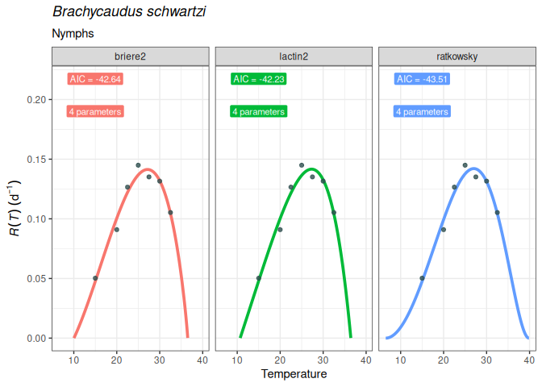

<!-- README.md is generated from README.Rmd. Please edit that file -->

# mappestRisk

<!-- badges: start -->

[](https://github.com/EcologyR/templateRpackage/actions/workflows/R-CMD-check.yaml)
[](https://app.codecov.io/gh/EcologyR/templateRpackage?branch=master)
[](https://lifecycle.r-lib.org/articles/stages.html#experimental)
[](https://www.repostatus.org/#wip)
<!-- [](https://www.codefactor.io/repository/github/ecologyr/templaterpackage) -->

<!-- badges: end -->

The goal of mappestRisk package is to facilitate the transition from
development data of pests obtained in lab-controlled conditions to
understandable forecasts assessing risk of pest occurrence in a given
region.

For that purpose, mappestRisk is built upon previous efforts such as
`devRate` (Rebaudo, Struelens, and Dangles 2018), `rTPC` and
`nls.multstart` packages (Padfield, O’Sullivan, and Pawar 2021) and a
methodology for predicting climatic suitability based on fundamental
thermal niche as estimated by mechanistic, process-based approaches
suggested in Taylor et al. (2019) . Therefore, mappestRisk has three
different modules: *(1) model fitting & selection* using a set of the
most widely used equations describing developmental responses to
temperature under the `nls.multstart` (Padfield and Matheson 2020) and
`nlme` (Pinheiro, Bates 2022) frameworks, with visualization of model
fitting to help model selection by the user; (2) *thermal traits
extraction:* including selection of the suitability threshold guiding
the forecast (i.e. obtaining the temperatures at which estimated
performance lies upon a performance higher threshold percentage); and
(3) *climatic data extraction & visualization* with either exportable
rasters or interactive maps with `leaflet` (Cheng, Karambelkar, and Xie
2022).

## Installation

``` r
# install.packages("devtools")
# devtools::install_github("EcologyR/mappestRisk")

#or alternatively
# remotes::install_github("EcologyR/mappestRisk")

#and load the package
#library(mappestRisk)
devtools::load_all() #for now, provisionally
#> ℹ Loading mappestRisk
#> The legacy packages maptools, rgdal, and rgeos, underpinning this package
#> will retire shortly. Please refer to R-spatial evolution reports on
#> https://r-spatial.org/r/2023/05/15/evolution4.html for details.
#> This package is now running under evolution status 0
#> Warning: package 'testthat' was built under R version 4.2.2
```

If you want to clone or fork the repository or open and read some
issues, you can find the code
[here](https://github.com/EcologyR/mappestRisk).

## Example: mappestRisk workflow

### 1. Fit a thermal performance curve (TPC) to your data:

In this example, we’ll show how to fit one to several thermal
performance curves to a data set of development rate variation across
temperatures[^1]. The following code provides an example as given in
`fit_devmodels()` function documentation, with a data table showing the
output of fitted models.

``` r

data("h.vitripennis_pilkington2014")

fitted_tpcs_sharpshooter <- fit_devmodels(temp = h.vitripennis_pilkington2014$temperature,
              dev_rate = h.vitripennis_pilkington2014$rate_development,
              model_name = c("all"), #might be a bit slow
              variance_model = "exp") 
#> Warning in start_vals_devRate(model_name = i, temperature = temp, dev_rate =
#> dev_rate): briere1 start values are uninformative; default to `c(tmin = 6, tmax
#> = 32, a = 1e-04)`
#> [1] "approximate covariance matrix for parameter estimates not of full rank"
#> [1] "approximate covariance matrix for parameter estimates not of full rank"
#> [1] "approximate covariance matrix for parameter estimates not of full rank"
#> [1] "approximate covariance matrix for parameter estimates not of full rank"
#> [1] "approximate covariance matrix for parameter estimates not of full rank"
#> [1] "approximate covariance matrix for parameter estimates not of full rank"
print(fitted_tpcs_sharpshooter)
#> # A tibble: 16 × 8
#>    param_name start_vals param_est param_se model_name model_AIC model_fit fit  
#>    <chr>           <dbl>     <dbl>    <dbl> <chr>          <dbl> <list>    <chr>
#>  1 tmin       12.9         1.28e+1  3.78e-1 briere1       -3097. <gnls>    okay 
#>  2 tmax       34.9         3.50e+1  4.56e-1 briere1       -3097. <gnls>    okay 
#>  3 a           0.0000240   2.36e-5  1.39e-6 briere1       -3097. <gnls>    okay 
#>  4 rmax        0.0469      2.72e-2  3.78e-4 mod_gauss…    -3097. <gnls>    okay 
#>  5 topt       30           2.99e+1  3.99e-1 mod_gauss…    -3097. <gnls>    okay 
#>  6 a          13           8.20e+0  3.09e-1 mod_gauss…    -3097. <gnls>    okay 
#>  7 a           0.119       2.12e-3  2.80e-4 lactin2       -3096. <gnls>    okay 
#>  8 b          -0.254      -1.03e+0  5.10e-3 lactin2       -3096. <gnls>    okay 
#>  9 tmax       33           4.62e+1  6.08e+0 lactin2       -3096. <gnls>    okay 
#> 10 delta_t     3           3.35e+0  1.55e+0 lactin2       -3096. <gnls>    okay 
#> 11 tmin       20           1.26e+1  8.80e-1 briere2       -3096. <gnls>    okay 
#> 12 tmax       33           3.46e+1  1.88e+0 briere2       -3096. <gnls>    okay 
#> 13 a           0.0002      2.59e-5  1.04e-5 briere2       -3096. <gnls>    okay 
#> 14 b           3           2.16e+0  7.77e-1 briere2       -3096. <gnls>    okay 
#> 15 intercept  -0.0111     -1.79e-2  9.39e-4 linear_ca…    -3034. <gnls>    okay 
#> 16 slope       0.00129     1.57e-3  4.14e-5 linear_ca…    -3034. <gnls>    okay
```

### 2. Plot the fitted TPCs and select the most appropriate:

To help select which model might be more appropriate, the function
`plot_devmodels()` draws the predicted TPCs for each
adequately-converged model. This step aims to improve model selection
based not only on statistical criteria (i.e. AIC and number of
parameters) but also on ecological realism, since curves can be
graphically checked to select realistic shapes and thermal traits
–vertical cuts with x-axis such as $CT_\min$, $CT_\max$ and $T_{opt}$ .

``` r
library(ggplot2)
library(dplyr)
#> 
#> Attaching package: 'dplyr'
#> The following object is masked from 'package:testthat':
#> 
#>     matches
#> The following objects are masked from 'package:stats':
#> 
#>     filter, lag
#> The following objects are masked from 'package:base':
#> 
#>     intersect, setdiff, setequal, union
plot_devmodels(temp = h.vitripennis_pilkington2014$temperature,
               dev_rate = h.vitripennis_pilkington2014$rate_development,
               fitted_parameters = fitted_tpcs_sharpshooter)
```



### 3. Calculate thermal suitability bounds:

Once a model have been selected under both ecological realism and
statistical criteria, the user can estimate the thermal boundaries
defining the suitable range of temperatures for the studied population.
The `thermal_suitability_bounds()` function calculate these values given
the `fitted_parameters` output from `fit_devmodels()` and the selected
model name. Additionally, a value of suitability defining the
quantile-upper part of the curve can be provided by the user. The output
is a tibble / data.frame with the model name, the suitability threshold
and the two *thermal boundaries* required for the mapping functions (as
described below).

``` r
thermal_boundaries_sharpshooter <- thermal_suitability_bounds(fitted_parameters = fitted_tpcs_sharpshooter,
                           model_name = "briere1", # <- seems realistic according to `plot_devmodels()` and `fit_devmodels()` outputs
                           suitability_threshold = 75)
print(thermal_boundaries_sharpshooter)
#> # A tibble: 1 × 4
#>   model_name tval_left tval_right suitability
#>   <chr>          <dbl>      <dbl> <chr>      
#> 1 briere1         23.7       33.4 75 %
```

### 4. Climatic data extraction and projection

Using the thermal boundaries provided by the previous function and a set
of raster maps of monthly temperatures for a given region (which can be
provided by the user or downloaded by the function), a map can be
produced showing where (and for how many months a year) thermal
conditions are suitable for the development of the pest.

``` r
# downloading data from geodata::wordlclim_global. It will take several minutes the first time you use the function on the same 'path'.
risk_rast <- map_risk(t_vals = c(thermal_boundaries_sharpshooter$tval_left,
                                 thermal_boundaries_sharpshooter$tval_right),
                      path = "~/downloaded_maps", # directory to download data
                      region = "Réunion", 
                      verbose = TRUE)
#> 
#> (Down)loading countries map...
#> 
#> (Down)loading temperature rasters...
#> 
#> Cropping temperature rasters to region...
#> 
#> Computing final summary layer...
#> 
#> Finished!
terra::plot(risk_rast[[13]]) # the last layer represents the sum of suitable months within a year; the first 12 layers, the monthly binary value (1, if suitable; 0, if not suitable).
```


``` r

#we can also save the raster with:
# terra::writeRaster(risk_rast, filename = "~/output_maps/risk_rast.tif")

# Alternatively, if you already have a raster of monthly average temperatures for your region of interest, you can use it as an input of `map_risk()`
## load it (here Luxembourg data)
tavg_file <- system.file("extdata/tavg_lux.tif", package = "mappestRisk")
## convert it into a raster-compatible file with `terra`
tavg_rast <- terra::rast(tavg_file)
## and apply the function
risk_rast_binary <- map_risk(t_vals = c(thermal_boundaries_sharpshooter$tval_left,
                                        thermal_boundaries_sharpshooter$tval_right), 
                             t_rast = tavg_rast)
# terra::plot(risk_rast_binary[[13]]) # the last layer represents the sum of suitable months within a year; the 12-th previous ones, the monthly binary value (1, if suitable; 0, if not suitable).
```

### 5. Interactive map with `leaflet`

``` r
example <- interactive_map(x = risk_rast_binary, map_type = "high",
                path_out = paste0(tempdir(), "test_map.html"))
#> Warning in showSRID(uprojargs, format = "PROJ", multiline = "NO", prefer_proj =
#> prefer_proj): Discarded ellps WGS 84 in Proj4 definition: +proj=merc +a=6378137
#> +b=6378137 +lat_ts=0 +lon_0=0 +x_0=0 +y_0=0 +k=1 +units=m +nadgrids=@null
#> +wktext +no_defs +type=crs
#> Warning in showSRID(uprojargs, format = "PROJ", multiline = "NO", prefer_proj =
#> prefer_proj): Discarded datum World Geodetic System 1984 in Proj4 definition
#> Warning in showSRID(uprojargs, format = "PROJ", multiline = "NO", prefer_proj =
#> prefer_proj): Discarded ellps WGS 84 in Proj4 definition: +proj=merc +a=6378137
#> +b=6378137 +lat_ts=0 +lon_0=0 +x_0=0 +y_0=0 +k=1 +units=m +nadgrids=@null
#> +wktext +no_defs +type=crs
#> Warning in showSRID(uprojargs, format = "PROJ", multiline = "NO", prefer_proj =
#> prefer_proj): Discarded datum World Geodetic System 1984 in Proj4 definition
#example

#htmlwidgets::saveWidget(example,file = "index.html")
```

## Citation

If using this package, please cite it:

``` r
#citation("mappestRisk")
```

## Funding

The development of this software has been funded by Fondo Europeo de
Desarrollo Regional (FEDER) and Consejería de Transformación Económica,
Industria, Conocimiento y Universidades of Junta de Andalucía (proyecto
US-1381388 led by Francisco Rodríguez Sánchez, Universidad de Sevilla).


## References:

<div id="refs" class="references csl-bib-body hanging-indent">

<div id="ref-leaflet" class="csl-entry">

Cheng, Joe, Bhaskar Karambelkar, and Yihui Xie. 2022. “Leaflet: Create
Interactive Web Maps with the JavaScript ’Leaflet’ Library.”
<https://CRAN.R-project.org/package=leaflet>.

</div>

<div id="ref-nls.multstart" class="csl-entry">

Padfield, Daniel, and Granville Matheson. 2020. “Nls.multstart: Robust
Non-Linear Regression Using AIC Scores.”
<https://CRAN.R-project.org/package=nls.multstart>.

</div>

<div id="ref-padfield2021" class="csl-entry">

Padfield, Daniel, Hannah O’Sullivan, and Samraat Pawar. 2021. “rTPC and
Nls.multstart: A New Pipeline to Fit Thermal Performance Curves in r.”
*Methods in Ecology and Evolution* 12 (6): 1138–43.
<https://doi.org/10.1111/2041-210X.13585>.

</div>

<div id="ref-nlme" class="csl-entry">

Pinheiro, José, Douglas Bates, and R Core Team. 2022. “Nlme: Linear and
Nonlinear Mixed Effects Models.”
<https://CRAN.R-project.org/package=nlme>.

</div>

<div id="ref-rebaudo2018" class="csl-entry">

Rebaudo, François, Quentin Struelens, and Olivier Dangles. 2018.
“Modelling Temperature-Dependent Development Rate and Phenology in
Arthropods: The devRate Package for r.” *Methods in Ecology and
Evolution* 9 (4): 1144–50.
https://doi.org/<https://doi.org/10.1111/2041-210X.12935>.

</div>

<div id="ref-taylor2019" class="csl-entry">

Taylor, Rachel A., Sadie J. Ryan, Catherine A. Lippi, David G. Hall,
Hossein A. Narouei-Khandan, Jason R. Rohr, and Leah R. Johnson. 2019.
“Predicting the Fundamental Thermal Niche of Crop Pests and Diseases in
a Changing World: A Case Study on Citrus Greening.” *Journal of Applied
Ecology* 56 (8): 2057–68. <https://doi.org/10.1111/1365-2664.13455>.

</div>

</div>

[^1]: At least 4 unique temperatures are required. Fore more details,
    see *vignette*.
