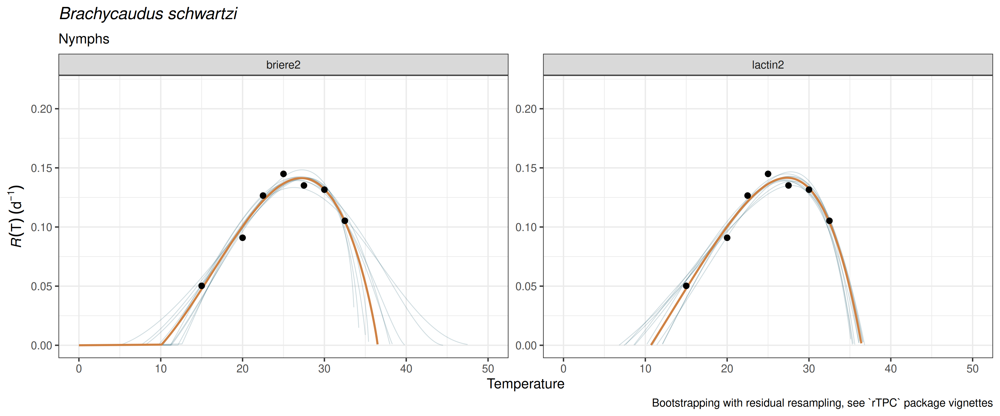
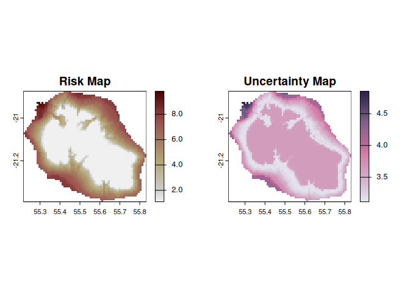

<!-- README.md is generated from README.Rmd. Please edit that file -->

# mappestRisk <a href="https://ecologyr.github.io/mappestRisk/"></a>

<!-- badges: start -->

[](https://cran.r-project.org/package=mappestRisk)

[](https://github.com/EcologyR/mappestRisk/actions/workflows/R-CMD-check.yaml)
[](https://lifecycle.r-lib.org/articles/stages.html#stable)
[](https://www.repostatus.org/#active)

<!-- badges: end -->

## Aims of the package

The goal of `mappestRisk` package is to facilitate the transition from
development data of arthropod crop-pests’ thermal biology obtained in
lab-controlled conditions to understandable forecasts assessing risk of
pest occurrence in a given region. Closing this gap usually involves two
key steps: (1) fitting and selecting nonlinear regression models and
derived thermal traits under ecological criteria, and (2) projecting
these traits onto interest regions for pest risk assessment by
extracting climate data. However, most data producers from physiology
labs have limited opportunities and time to develop their R programming
skills, so addressing these two steps may not be straightforward.

For this purpose, `mappestRisk` intends to facilitate this workflow for
any researcher with minimal, basic R programming skills. This package
has been built upon previous efforts such as `devRate` (François
Rebaudo, Struelens, and Dangles 2018), `rTPC` and `nls.multstart`
packages (Padfield, O’Sullivan, and Pawar 2021) and a methodology for
predicting climatic suitability based on fundamental thermal niche as
estimated by thermal performance curves, as suggested in Taylor et al.
(2019) . Up to date, `mappestRisk` is built for modelling developmental
thermal performance curves, since this is the most commonly measured
life-history trait in experimental approaches and it has major
contributions to fitness dependence on temperature (Pawar et al. 2024)
and it also allows to predict phenologies (Schmalensee et al. 2021).

Therefore, `mappestRisk` has three different modules: *(1) model fitting
& selection* using a set of the most commonly used equations describing
developmental responses to temperature under the `nls.multstart`
framework (Padfield and Matheson 2020) using equation helpers from
`rTPC`(Padfield and O’Sullivan 2023) and `devRate` (Francois Rebaudo and
Regnier 2024), with visualization of model fitting to help model
selection by the user; (2) *calculation of suitability thermal limits,*
which consist on a temperature interval delimiting the optimal
performance zone or suitability; and (3) *climatic data extraction &
visualization* with either exportable rasters or static or interactive
map figures.

## Installation

`mappestRisk` package can be installed from the
[r-universe](https://ecologyr.r-universe.dev/mappestRisk):

``` r
install.packages('mappestRisk', repos = c('https://ecologyr.r-universe.dev', 'https://cloud.r-project.org')) 
```

Or from the [GitHub
repository](https://github.com/EcologyR/mappestRisk):

``` r
remotes::install_github("EcologyR/mappestRisk")  
```

## Example: `mappestRisk` workflow

### 1. Fit thermal performance curves (TPC) to your data and plot results and parameter uncertainty:

In this example, we’ll show how to fit one to several thermal
performance curves to a data set of development rate variation across
temperatures[^1]. The following code provides an example as given in
`fit_devmodels()` function documentation, with a data table showing the
output of fitted models, and how to visualize them for selecting curves
using `plot_devmodels()`.

``` r
library("mappestRisk")
data("aphid") 
fitted_tpcs <- fit_devmodels(temp = aphid$temperature,  
                             dev_rate = aphid$rate_value, 
                             model_name = c("briere2", "lactin2", "ratkowsky"))

plot_devmodels(temp = aphid$temperature,
               dev_rate = aphid$rate_value,
               fitted_parameters = fitted_tpcs,
               species = "Brachycaudus schwartzi",
               life_stage = "Nymphs")
```


For a more complete explanation and example of model fitting and
visualization, see [TPCs model
fitting](articles/tpcs-model-fitting.html) article.

Additionally, we recommend here to propagate uncertainty in parameter
estimation of the fitted and selected TPC models using bootstrap
procedures with *residual resampling*, following vignettes of `rTPC`
package (Padfield, O’Sullivan, and Pawar 2021). This can be done with
the function `predict_curves()` by setting the argument
`propagate_uncertainty` to be `TRUE`. Resulting predictions can be
plotted using `plot_uncertainties()`. A detailed explanation is given in
the [TPCs model fitting](articles/tpcs-simulate-bootstrap.html) article.

``` r
preds_boots <- predict_curves(temp = aphid$temperature,          
                              dev_rate = aphid$rate_value,
                              fitted_parameters = fitted_tpcs,
                              model_name_2boot = c("briere2", "lactin2"),
                              propagate_uncertainty = TRUE,
                              n_boots_samples = 10)
#> 
#> Note: the simulation of new bootstrapped curves takes some time. Await patiently or reduce your `n_boots_samples`
#> 
#>  Bootstrapping simulations completed for briere2
#> 
#>  Bootstrapping simulations completed for lactin2

plot_uncertainties(bootstrap_tpcs = preds_boots,
                   temp = aphid$temperature,
                   dev_rate = aphid$rate_value,
                   species = "Brachycaudus schwartzi",
                   life_stage = "Nymphs")
```



### 2. Calculate thermal suitability bounds:

After the previous steps, the user can calculate the thermal boundaries
of the optimal zone of the TPC –i.e., those temperature values yielding
the Y-th quantile of the development rate (default to
$`\mathrm{Q}_{75}`$) at both sides of the curve peak or $`R_\max`$. Once
a model has been selected under both ecological and statistical
criteria, the `thermal_suitability_bounds()` function calculates these
values:

``` r
boundaries <- therm_suit_bounds(preds_tbl = preds_boots,
                                model_name = "briere2",        
                                suitability_threshold = 80) 
```

### 3. Climatic data extraction and projection

These optimal thermal boundaries are used for spatial projection of pest
risk. The `map_risk()` function automatically downloads temperature data
into a `SpatRaster` format from
[WorldClim](https://worldclim.org/data/worldclim21.html) masked into an
user-defined region or area, and then calculates the number of months
per year with highly suitable temperatures for pest development.

``` r
risk_rast <- map_risk(t_vals = boundaries, 
                      region = "Réunion",   
                      path = tempdir() # directory to download climate data 
                      )
```



### Citation

If using this package, please cite it:

``` r
citation("mappestRisk") 
To cite package 'mappestRisk' in publications use:

  San-Segundo Molina D, Barbosa A, Pérez-Luque A, Rodríguez-Sánchez F
  (2025). _mappestRisk: An R package for modelling and mapping risk of
  pest development based on known thermal limits_.
  <https://ecologyr.github.io/mappestRisk>.

A BibTeX entry for LaTeX users is

  @Manual{,
    title = {mappestRisk: An R package for modelling and mapping risk of pest development based on
  known thermal limits},
    author = {Darío {San-Segundo  Molina} and A. Márcia Barbosa and Antonio Jesús Pérez-Luque and Francisco Rodríguez-Sánchez},
    year = {2025},
    url = {https://ecologyr.github.io/mappestRisk},
  }
```

## Funding

The development of this software has been funded by Fondo Europeo de
Desarrollo Regional (FEDER) and Consejería de Transformación Económica,
Industria, Conocimiento y Universidades of Junta de Andalucía (proyecto
US-1381388, Universidad de Sevilla).


## References:

<div id="refs" class="references csl-bib-body hanging-indent"
entry-spacing="0">

<div id="ref-nls.multstart" class="csl-entry">

Padfield, Daniel, and Granville Matheson. 2020. “Nls.multstart: Robust
Non-Linear Regression Using AIC Scores.”
<https://CRAN.R-project.org/package=nls.multstart>.

</div>

<div id="ref-rTPC" class="csl-entry">

Padfield, Daniel, and Hannah O’Sullivan. 2023. “rTPC: Fitting and
Analysing Thermal Performance Curves.”
<https://CRAN.R-project.org/package=rTPC>.

</div>

<div id="ref-padfield2021" class="csl-entry">

Padfield, Daniel, Hannah O’Sullivan, and Samraat Pawar. 2021. “rTPC and
Nls.multstart: A New Pipeline to Fit Thermal Performance Curves in r.”
*Methods in Ecology and Evolution* 12 (6): 1138–43.
<https://doi.org/10.1111/2041-210X.13585>.

</div>

<div id="ref-pawar2024" class="csl-entry">

Pawar, Samraat, Paul J. Huxley, Thomas R. C. Smallwood, Miles L. Nesbit,
Alex H. H. Chan, Marta S. Shocket, Leah R. Johnson, Dimitrios-Georgios
Kontopoulos, and Lauren J. Cator. 2024. “Variation in Temperature of
Peak Trait Performance Constrains Adaptation of Arthropod Populations to
Climatic Warming.” *Nature Ecology & Evolution*, January, 1–11.
<https://doi.org/10.1038/s41559-023-02301-8>.

</div>

<div id="ref-devRate" class="csl-entry">

Rebaudo, Francois, and Baptiste Regnier. 2024. “devRate: Quantify the
Relationship Between Development Rate and Temperature in Ectotherms.”
<https://CRAN.R-project.org/package=devRate>.

</div>

<div id="ref-rebaudo2018" class="csl-entry">

Rebaudo, François, Quentin Struelens, and Olivier Dangles. 2018.
“Modelling Temperature-Dependent Development Rate and Phenology in
Arthropods: The devRate Package for r.” *Methods in Ecology and
Evolution* 9 (4): 1144–50.
https://doi.org/<https://doi.org/10.1111/2041-210X.12935>.

</div>

<div id="ref-vonschmalensee2021" class="csl-entry">

Schmalensee, Loke von, Katrín Hulda Gunnarsdóttir, Joacim Näslund, Karl
Gotthard, and Philipp Lehmann. 2021. “Thermal Performance Under Constant
Temperatures Can Accurately Predict Insect Development Times Across
Naturally Variable Microclimates.” *Ecology Letters* 24 (8): 1633–45.
<https://doi.org/10.1111/ele.13779>.

</div>

<div id="ref-taylor2019" class="csl-entry">

Taylor, Rachel A., Sadie J. Ryan, Catherine A. Lippi, David G. Hall,
Hossein A. Narouei-Khandan, Jason R. Rohr, and Leah R. Johnson. 2019.
“Predicting the Fundamental Thermal Niche of Crop Pests and Diseases in
a Changing World: A Case Study on Citrus Greening.” *Journal of Applied
Ecology* 56 (8): 2057–68. <https://doi.org/10.1111/1365-2664.13455>.

</div>

</div>

[^1]: At least 4 unique temperatures are required. Fore more details,
    see documentation and vignettes.
