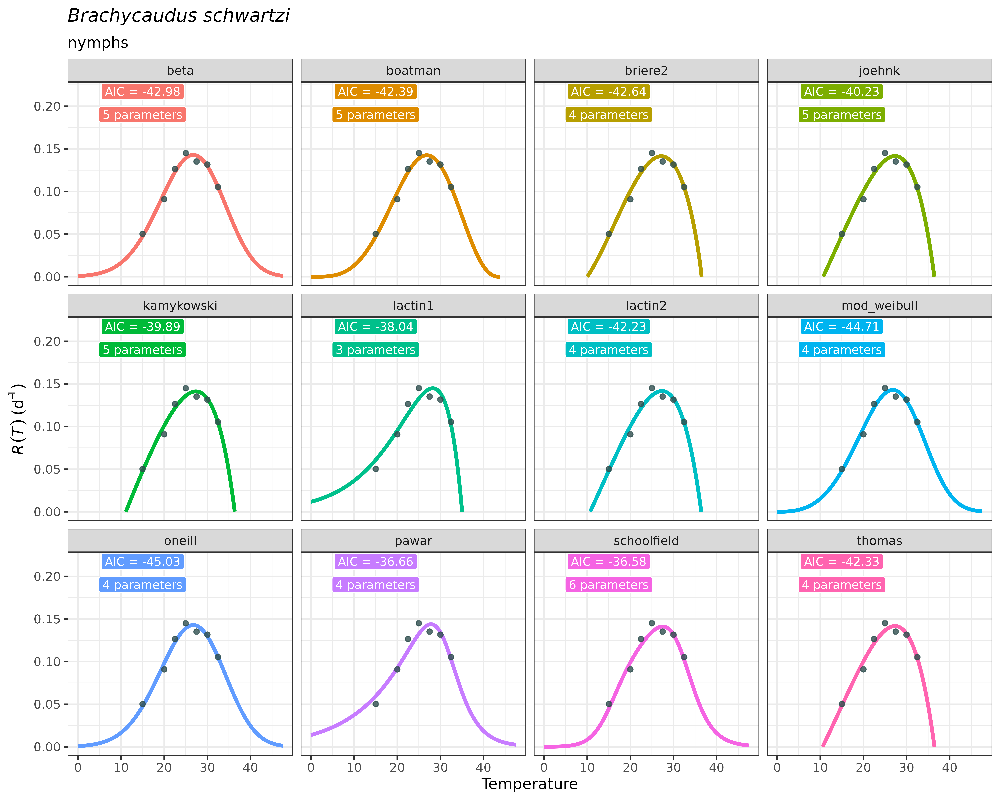

# TPCs model fitting

## Fit a thermal performance curve (TPC) to your data:

The Thermal Performance Curves can be understood as models describing
the nonlinear temperature dependence of several biological rates
(Amarasekare and Savage 2012). TPC shapes are usually unimodal and
left-skewed (Huey and Stevenson 1979), which is also the case for
development rate TPCs of insects (Régnier, Legrand, and Rebaudo 2022).
Fitting these nonlinear regression models requires to incorporate *a
priori* knowledge on model parameters. For that purpose, the R packages
`rTPC` (Padfield, O’Sullivan, and Pawar 2021; Padfield, O’Sullivan, and
Windram 2025)and `devRate`(Francois Rebaudo and Regnier 2025; François
Rebaudo, Struelens, and Dangles 2018) have provided R functions and
workflows to facilitate model fitting, start values selection and
parameter calculation of TPCs. Additionally, `nls.multstart` package
(Padfield, O’Sullivan, and Pawar 2021; Padfield, Matheson, and Windram
2025) provides a nonlinear, least-squares framework to facilitate
fitting these curves to experimental data in a flexible and efficient
manner.

However, we believe that most researchers obtaining experimental data on
rate development across temperatures may not have enough R programming
knowledge to accomplish repeatedly the model fitting procedure in
reproducible workflows. Aiming to facilitate the usage of these previous
contributions made by the above-mentioned R packages to TPC modelling
for a broad-audience among experimental researchers, `mappestRisk` aims
to synthesize these software development into an unique function called
[`fit_devmodels()`](https://ecologyr.github.io/mappestRisk/reference/fit_devmodels.md).

This function takes for input a `data.frame` or `tibble` containing two
numeric columns: one with temperature data –with at least 4 unique
temperature treatments– and the other with development rate data. The
user can select which models to fit among those included in
`available_models` (or use them all). Then, for each model equation, the
function will search for the most appropriate start values data for
performing nonlinear regression models using
[`rTPC::get_start_vals()`](https://rdrr.io/pkg/rTPC/man/get_start_vals.html)
when possible, or alternatively `devRate` parameter data set for models
not included in the former package. Once selected, the function will
also search for lower and upper thermal limits when possible using
[`rTPC::get_lower_lims()`](https://rdrr.io/pkg/rTPC/man/get_lower_lims.html)
or
[`rTPC::get_upper_lims()`](https://rdrr.io/pkg/rTPC/man/get_upper_lims.html).
Next, the function performs sequentially the nonlinear least-squares
regression models using
[`nls.multstart::nls_multstart()`](https://rdrr.io/pkg/nls.multstart/man/nls_multstart.html)
function for each set of model equation, start values and limits with
default configuration of `nls_multstart` approach (see function
documentation here). TPC models not achieving convergence are further
discarded.

In this example, we’ll show how to fit one to several thermal
performance curves to a data set of development rate variation across
temperatures[¹](#fn1). The following code provides an example as given
in
[`fit_devmodels()`](https://ecologyr.github.io/mappestRisk/reference/fit_devmodels.md)
function documentation, with a data table showing the output of fitted
models.

``` r
data("aphid")

fitted_tpcs_aphid <- fit_devmodels(temp = aphid$temperature,
                                   dev_rate = aphid$rate_value,
                                   model_name = "all")
#> By default, all models are fitted except `ratkowsky`, `mod_polynomial` and `wang` due to
#> unrealistic behavior at some TPC regions. If you still want to fit them, please write all model names manually
#> fitting model beta
#> fitting model boatman
#> fitting model briere1
#> generic starting values
#> fitting model briere2
#> fitting model joehnk
#> fitting model kamykowski
#> fitting model lactin1
#> fitting model lactin2
#> fitting model mod_weibull
#> fitting model oneill
#> fitting model pawar
#> fitting model schoolfield
#> fitting model thomas
```

After running
[`fit_devmodels()`](https://ecologyr.github.io/mappestRisk/reference/fit_devmodels.md),
a `tibble` (a specific case of `data.frame`) is created containing the
most relevant statistical information of the modelled TPCs: model name,
parameter information –name, estimates, standard error, AICs and listed
model objects.To continue the package workflow, this output must be
stored as an object (here we call it `fitted_tpcs_aphid`). This `tibble`
has the following aspect:

``` r
print(fitted_tpcs_aphid)
#> # A tibble: 53 × 8
#>    model_name param_name start_vals param_est    param_se model_AIC model_BIC
#>    <chr>      <chr>           <dbl>     <dbl>       <dbl>     <dbl>     <dbl>
#>  1 beta       a               0.145     0.143     0.00630     -43.0     -43.3
#>  2 beta       b              25        26.7       1.10        -43.0     -43.3
#>  3 beta       c              25       202.    13598.          -43.0     -43.3
#>  4 beta       d               2       100     12046.          -43.0     -43.3
#>  5 beta       e               2        32.6    2282.          -43.0     -43.3
#>  6 boatman    rmax            0.145     0.142     0.00648     -42.4     -42.7
#>  7 boatman    tmin           15         0       104.          -42.4     -42.7
#>  8 boatman    tmax           32.5      43.7      66.7         -42.4     -42.7
#>  9 boatman    a               1.1       1.42      1.03        -42.4     -42.7
#> 10 boatman    b               0.4       2.44     20.0         -42.4     -42.7
#> # ℹ 43 more rows
#> # ℹ 1 more variable: model_fit <list>
```

Despite the output yields a table with explicit statistical information
and model objects with implicit additional information, selecting a
model should better be guided by ecological, rather that only
statistical criteria. This typically involves visualising the
predictions of the fitted TPCs for further visual examination. A
potential user of the package may use their expertise on thermal biology
and ecology of the species to distinguish which of the fitted TPCs
accomplish to approximate true temperature-development relationships.
For example, a fitted TPC model yielding a critical thermal maximum
beyond 50ºC –i.e., with a right-side vertical x-axis cutoff– may not be
realistic, as most species do not encounter this temperatures.
Similarly, models yielding quasi-symmetric TPCs or unexpected behaviors
at some regions of the curve may also be further discarded. We strongly
believe there is no a straightforward statistical strategy to select
among TPC models; instead, comparing a large number of fitted TPCs with
expertise ecological criteria may improve biological realism of for less
arbitrary model selection. Finally, accounting for the thermal regimes
that the species will likely encounter in the region of interest to
project risk may help select among curves by prioritizing curves with
specific expected behaviors in the TPC regions corresponding to these
thermal regimes.

The
[`plot_devmodels()`](https://ecologyr.github.io/mappestRisk/reference/plot_devmodels.md)
function facilitates quick visualizations of predictions of the Thermal
Performance Curves to guide model selection under ecological criteria.
It takes as an input the resulting `tibble`/`data.frame` stored as an
object from
[`fit_devmodels()`](https://ecologyr.github.io/mappestRisk/reference/fit_devmodels.md).
It has also arguments to title and subtitle the figure with the species’
name and the life stage evaluated, respectively. Since wrapped in the
`ggplot2` approach, customization is available by adding new lines with
compatible functions with `ggplot2`.

Following the previous example:

``` r
plot_devmodels(temp = aphid$temperature,
               dev_rate = aphid$rate_value,
               fitted_parameters = fitted_tpcs_aphid,
               species = "Brachycaudus schwartzi",
               life_stage = "nymphs")
```



As you can see, the plot is faceted across TPC models included in
`fitted_tpcs_aphid`.

## References

Amarasekare, Priyanga, and Van Savage. 2012. “A framework for
elucidating the temperature dependence of fitness.” *The American
Naturalist* 179 (2): 178–91. <https://doi.org/10.1086/663677>.

Huey, Raymond, and Robert Stevenson. 1979. “Integrating Thermal
Physiology and Ecology of Ectotherms: A Discussion of Approaches.”
*American Zoologist* 19 (February).
<https://doi.org/10.1093/icb/19.1.357>.

Padfield, Daniel, Granville Matheson, and Francis Windram. 2025.
“Nls.multstart: Robust Non-Linear Regression Using AIC Scores.”
<https://CRAN.R-project.org/package=nls.multstart>.

Padfield, Daniel, Hannah O’Sullivan, and Samraat Pawar. 2021. “rTPC and
Nls.multstart: A New Pipeline to Fit Thermal Performance Curves in r.”
*Methods in Ecology and Evolution* 12 (6): 1138–43.
<https://doi.org/10.1111/2041-210X.13585>.

Padfield, Daniel, Hannah O’Sullivan, and Francis Windram. 2025. “rTPC:
Fitting and Analysing Thermal Performance Curves.”
<https://github.com/padpadpadpad/rTPC>.

Rebaudo, Francois, and Baptiste Regnier. 2025. “devRate: Quantify the
Relationship Between Development Rate and Temperature in Ectotherms.”
<https://CRAN.R-project.org/package=devRate>.

Rebaudo, François, Quentin Struelens, and Olivier Dangles. 2018.
“Modelling Temperature-Dependent Development Rate and Phenology in
Arthropods: The devRate Package for r.” *Methods in Ecology and
Evolution* 9 (4): 1144–50.
https://doi.org/<https://doi.org/10.1111/2041-210X.12935>.

Régnier, Baptiste, Judith Legrand, and François Rebaudo. 2022. “Modeling
Temperature-Dependent Development Rate in Insects and Implications of
Experimental Design.” *Environmental Entomology* 51 (1): 132–44.
<https://doi.org/10.1093/ee/nvab115>.

------------------------------------------------------------------------

1.  At least 4 unique temperatures are required. Fore more details, see
    documentation.
