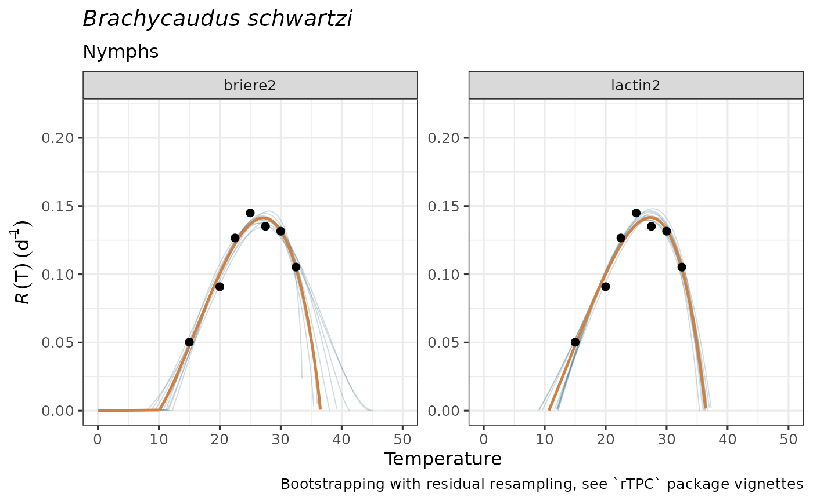

# Simulate TPCs with bootstrap to propagate uncertainty

``` r
library(mappestRisk)
```

## Simulate $n$-thermal performance curves using bootstrap with residual resampling

### Why propagating uncertainty?

Forecasting necessarily incorporates uncertainties in how much we know
about the knowledge of the target system (i.e., model structure,
parameter uncertainty, response or predictor variable errors, etc) that
adds together with uncertainty in how to communicate findings and an
unavoidable randomness within natural systems (Simmonds et al. 2022).
Specifically, propagating parameter uncertainty for estimation of
performance and fitness through thermal performance curves and translate
them into geographical predictions result critical to prevent biased
forecasts (Woods et al. 2018).

At least three different uncertainty sources of the models should be
addressed in forecasts:

1.  **Parameter uncertainty:** the accuracy of estimated parameters of
    the models may affect the confidence of the predictions. For example
    in the [TPCs model
    fitting](https://ecologyr.github.io/mappestRisk/articles/articles/tpcs-model-fitting.md)
    article, the `briere2` model yields
    $CT_{\max} = 36.5 \pm 3.40\ \text{ºC}$. Let’s imagine a forecaster
    aiming to identify “safe” regions where the pest may not be
    established due to extremely high maximum temperatures (e.g.,
    $T_{\max} > {\bar{CT}}_{\max}$). It’s possible that all the
    forecasting regions have monthly maximum temperatures of about 34ºC,
    which lie below the $CT_{\max}$ estimate of 36.5 ºC, leading to
    identify no risk for the assessment. However, if we incorporate how
    the uncertainty of each parameter contributes to the variability of
    the predicted TPC with simulated TPC ribbons in the plot –see e.g.,
    below with
    [`plot_uncertainties()`](https://ecologyr.github.io/mappestRisk/reference/plot_uncertainties.md),
    there are possible scenarios at which several TPC-calculated
    $CT_{\max}$’s lie below 34ºC, yielding a not-negligible risk
    likelihood.
2.  **Predictor uncertainty:** incorporating the variability of the
    predictor –in the above case, monthly maximum temperatures– will
    also yield a probability distribution of forecast outcomes (let’s
    say $T_{\max} = 34\text{ºC},\ CI = \lbrack 31.2,36.8\rbrack$). This
    would result in some scenarios with maximum temperatures above
    $CT_{\max}$ estimate of $36.5$ºC and some others where they have
    not.
3.  **Source data uncertainty:** additionally, TPCs are usually fitted
    to summarized data from experiments in laboratory conditions. These
    measures incorporate both both measurement error (at the individual
    level) and uncertainty measures summarizing the variability of rate
    estimates at the population level.

For now, `mappestRisk` enables to explicitly account for parameter
uncertainty by simulating $n$ TPCs using bootstrapping techniques with
residual resampling, as suggested and implemented by `rTPC` package (see
[this
vignette/article](https://padpadpadpad.github.io/rTPC/articles/bootstrapping_many_curves.html)
(Padfield, O’Sullivan, and Windram 2025)) as described in the section
below. Measurement uncertainty of source data might be further
incorporated in future enhancement updates of the package through a
`weights` argument of
[`fit_devmodels()`](https://ecologyr.github.io/mappestRisk/reference/fit_devmodels.md)
and
[`predict_curves()`](https://ecologyr.github.io/mappestRisk/reference/predict_curves.md)
(Padfield, O’Sullivan, and Pawar 2021) since they are based on the
`rTPC` - `nls.multstart` framework that has recently incorporated an
[article on how to simulate curves by weighted
bootstrapping](https://padpadpadpad.github.io/rTPC/articles/weighted_bootstrapping.html).
Finally, a discussion on how to deal with predictor uncertainty of the
forecasts and how to overcome communication uncertainty is given in the
[generate-risk-maps vignette
article](https://ecologyr.github.io/mappestRisk/articles/articles/generate-risk-maps.md).

### Simulate bootstrapped TPCs with `predict_curves()`

As mentioned above, `mappestRisk` includes two functions that automate
the workflow suggested by `rTPC` package to simulate curves for
propagating parameter uncertainty. We implemented the *residual
resampling* method following `rTPC` vignette suggestions, but with a raw
resampling code workflow rather than using `car::Boot()` function for
simplicity. We opted for the residual resampling rather than the case
resampling bootstrapping method as the predictor data are controlled by
the experimental researchers and there are usually few data points per
curve, with low representation of the hot decay TPC region in the source
data that would make many case resampling iterations difficult for
refitting new TPC models. For further insights on the methodology,
please refer to the [the original `rTPC`
vignette](https://padpadpadpad.github.io/rTPC/articles/bootstrapping_models.html#residual-resampling).
Further updates of the package may incorporate variance modelling for
heteroscedastic residuals, as well as an argument to choice between
*residual* *resampling* and *case resampling*[¹](#fn1).

The
[`predict_curves()`](https://ecologyr.github.io/mappestRisk/reference/predict_curves.md)
function incorporates the temperature and development rate data
arguments, a `fitted_parameters` argument that requires as input the
table obtained from
[`fit_devmodels()`](https://ecologyr.github.io/mappestRisk/reference/fit_devmodels.md),
a `model_name_2boot` argument to choose which TPC model(s) to bootstrap
along those available in `fitted_parameters` and the number of bootstrap
samples, or `n_boots_samples`. The function implicitly extracts the
residuals and the fitted values of the estimated TPC from
[`fit_devmodels()`](https://ecologyr.github.io/mappestRisk/reference/fit_devmodels.md).
Then, it resamples with replacement these residuals. Next, the function
automatically calculates the new resampled observations for the
iteration $i$ (i.e., $y_{i}$) as follows:

$$y_{i} = \widehat{y} + e_{i}\ \ ,$$ where $\widehat{y_{i}}$ represent
the fitted values from the TPC model and $e_{i}$ denotes the resampled
residuals of that model. Note that $i$-th iteration is given by
`n_boots_samples`, or $n$. This results in $n$ resampled data sets. Each
of them is next used for fitting a new nonlinear model using
[`fit_devmodels()`](https://ecologyr.github.io/mappestRisk/reference/fit_devmodels.md);
those that adequately converged (a total $k$ models) constitute newly
bootstrapped nonlinear regression model. Finally, the function
calculates the predictions of these bootstrapped models along
temperature data –more specifically, 20ºC below and 15ºC above the
minimum and maximum temperature values, respectively, in `temp` argument
each 0.01ºC. This results in a total $n - k$ simulated thermal
performance curves that are used for propagating parameter uncertainty
for inference.

Here we have an example:

``` r
#fit previously:
data("aphid")
fitted_tpcs_aphid <- fit_devmodels(temp = aphid$temperature,
                                   dev_rate = aphid$rate_value,
                                   model_name = "all")
#> Warning in fit_devmodels(temp = aphid$temperature, dev_rate = aphid$rate_value,
#> : TPC model beta had one or more parameters with unexpectedly large standard
#> errors.
#> Warning in fit_devmodels(temp = aphid$temperature, dev_rate = aphid$rate_value,
#> : TPC model boatman had one or more parameters with unexpectedly large standard
#> errors.
#> Warning in fit_devmodels(temp = aphid$temperature, dev_rate = aphid$rate_value,
#> : TPC model briere1 had one or more parameters with unexpectedly large standard
#> errors.
#> Warning in fit_devmodels(temp = aphid$temperature, dev_rate = aphid$rate_value,
#> : TPC model joehnk had one or more parameters with unexpectedly large standard
#> errors.
#> Warning in fit_devmodels(temp = aphid$temperature, dev_rate = aphid$rate_value,
#> : TPC model kamykowski had one or more parameters with unexpectedly large
#> standard errors.
```

``` r
preds_boots_aphid <- predict_curves(temp = aphid$temperature,          
                                   dev_rate = aphid$rate_value,
                                   fitted_parameters = fitted_tpcs_aphid,
                                   model_name_2boot = c("briere2", "lactin2"),
                                   propagate_uncertainty = TRUE,
                                   n_boots_samples = 10)
#> Warning in predict_curves(temp = aphid$temperature, dev_rate =
#> aphid$rate_value, : 100 iterations might be desirable. Consider increasing
#> `n_boots_samples` if possible
#> 
#> Note: the simulation of new bootstrapped curves takes some time. Await patiently or reduce your `n_boots_samples`
#> 
#>  Bootstrapping simulations completed for briere2
#> 
#>  Bootstrapping simulations completed for lactin2
```

By default, the `predict_curves` function does propagate uncertainty by
simulating as many curves as asked through `n_boots_samples` argument
for each of the selected models from `model_name_2boot`. If able to
perform bootstrap, this default configuration will output a `tibble`
with simulated TPCs for both plotting purposes and thermal traits
calculation. `n_boots_samples` is set up to 100 by default. We recommend
to avoid lower values that may inaccurately reflect uncertainty and to
think carefully when trying to perform bootstrap with larger samples,
since they may exponentially increase computational demands with little
benefit for the purposes addressed here. If `propagate_uncertainty` is
set to `FALSE`, the function will output the same `tibble` with one
single curve (temperatures and predictions) coming from the estimated
TPC (similar to those plotted in
[`plot_devmodels()`](https://ecologyr.github.io/mappestRisk/reference/plot_devmodels.md)for
applying subsequent steps in the `mappestRisk` suggested workflow.

The `tibble` output of `predict_curves` can be easily visualized with
[`plot_uncertainties()`](https://ecologyr.github.io/mappestRisk/reference/plot_uncertainties.md),
where the curve from the model estimate is plotted as a thicker, dark
orange line and the bootstrapped curves are depicted as slighter, dark
blue lines composing a sort of a ribbon for the central curve. If more
than one model has been successfully bootstrapped, predicted curves will
be plotted along different facets.

``` r
plot_uncertainties(bootstrap_tpcs = preds_boots_aphid,
                   temp = aphid$temperature,
                   dev_rate = aphid$rate_value,
                   species = "Brachycaudus schwartzi",
                   life_stage = "Nymphs")
#> Warning: Removed 500 rows containing missing values or values outside the scale range
#> (`geom_line()`).
#> Warning: Removed 50 rows containing missing values or values outside the scale range
#> (`geom_line()`).
```



These simulated TPCs may guide ecologically realistic model selection
and propagating parameter uncertainty for subsequent analyses. However,
as for
[`plot_devmodels()`](https://ecologyr.github.io/mappestRisk/reference/plot_devmodels.md),
we discourage selecting among TPC models solely based on statistical
information, but rather on informed ecological criteria.

Please, consider carefully whether your data is suitable for these
procedures.

## References

Padfield, Daniel, Hannah O’Sullivan, and Samraat Pawar. 2021. “rTPC and
Nls.multstart: A New Pipeline to Fit Thermal Performance Curves in r.”
*Methods in Ecology and Evolution* 12 (6): 1138–43.
<https://doi.org/10.1111/2041-210X.13585>.

Padfield, Daniel, Hannah O’Sullivan, and Francis Windram. 2025. “rTPC:
Fitting and Analysing Thermal Performance Curves.”
<https://github.com/padpadpadpad/rTPC>.

Simmonds, Emily G., Kwaku Peprah Adjei, Christoffer Wold Andersen, Janne
Cathrin Hetle Aspheim, Claudia Battistin, Nicola Bulso, Hannah M.
Christensen, et al. 2022. “Insights into the Quantification and
Reporting of Model-Related Uncertainty Across Different Disciplines.”
*iScience* 25 (12): 105512.
<https://doi.org/10.1016/j.isci.2022.105512>.

Sonderegger, Derek L., and Robert Buscaglia. 2020. “Appendix a :
Resampling Linear Models \| Introduction to Statistical Methodology,
Second Edition.” In. Bookdown.
<https://bookdown.org/dereksonderegger/570/appendix-a-resampling-linear-models.html>.

Woods, H. Arthur, Joel G. Kingsolver, Samuel B. Fey, and David A.
Vasseur. 2018. “Uncertainty in Geographical Estimates of Performance and
Fitness.” *Methods in Ecology and Evolution* 9 (9): 1996–2008.
<https://doi.org/10.1111/2041-210X.13035>.

------------------------------------------------------------------------

1.  More methods to perform these bootstrap resampling techniques are
    given in (Sonderegger and Buscaglia 2020).
